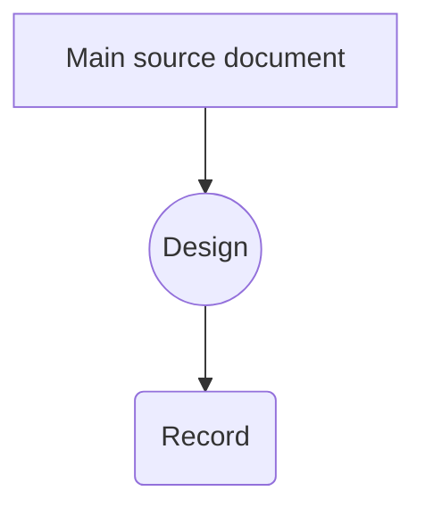
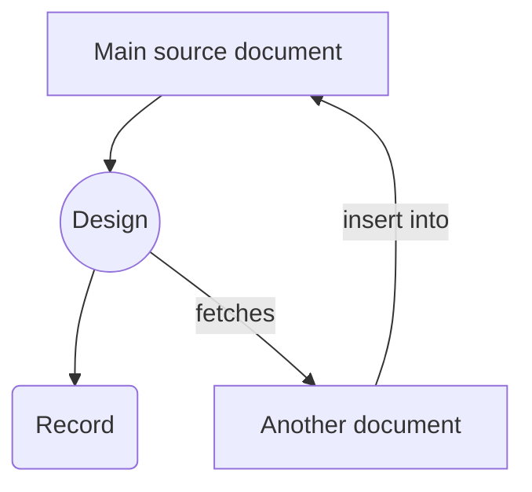
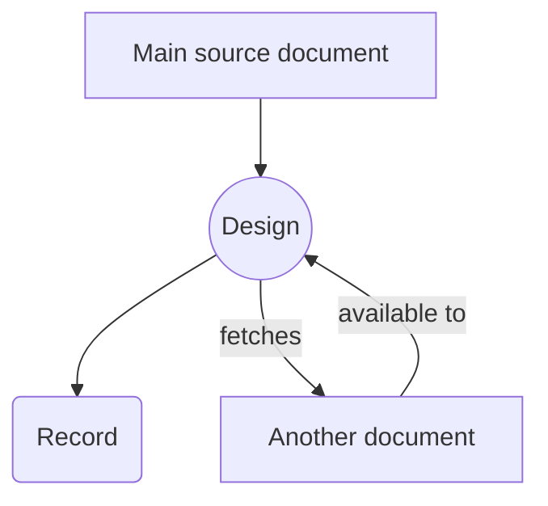
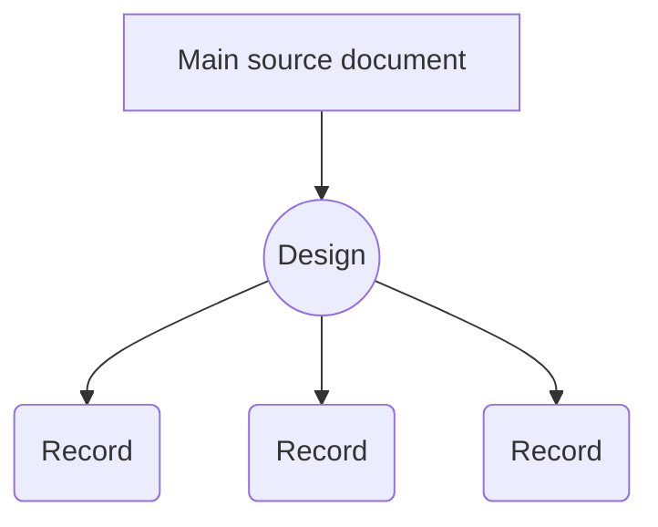
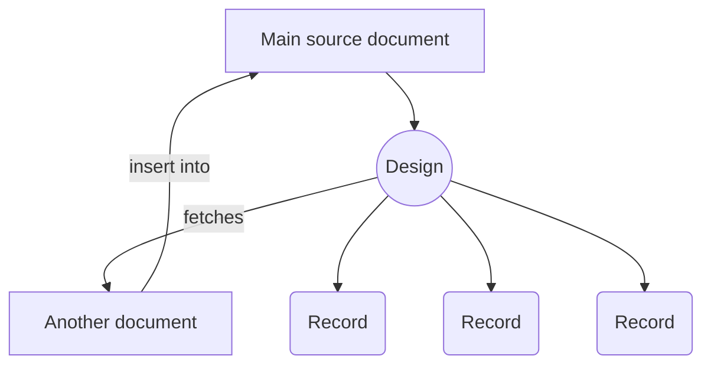
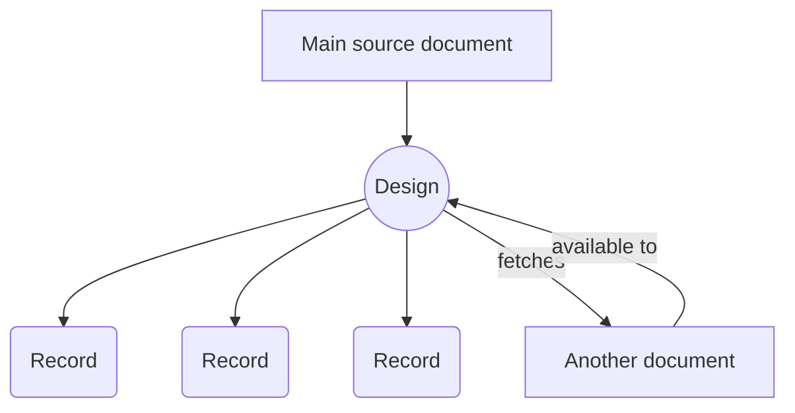
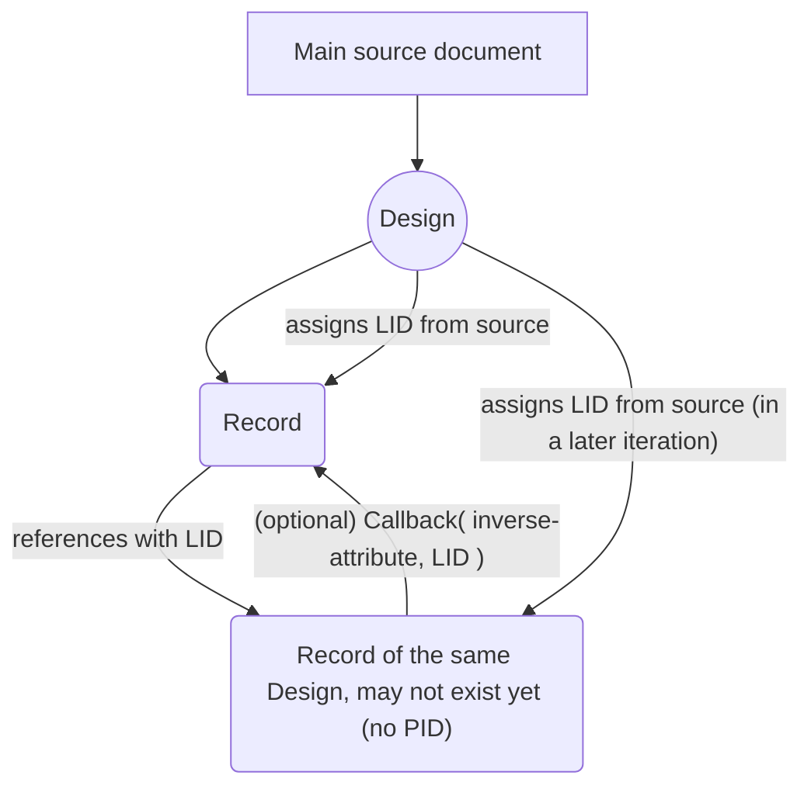
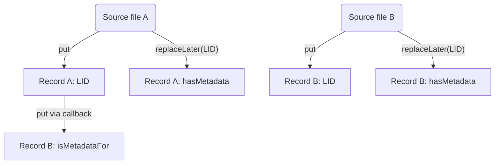
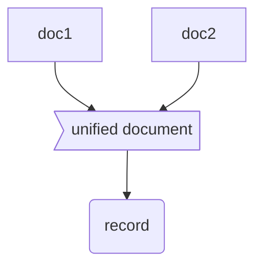
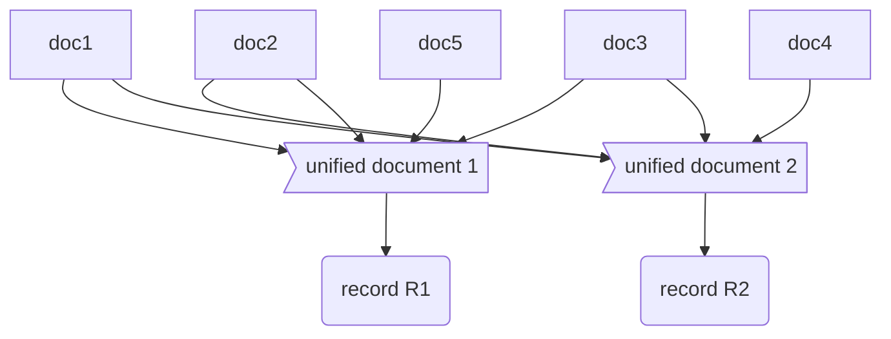

# Information Flow

## The flow within a single design

This is the simplest, ideal case, where a Design maps one document to one record.

For now, we assume there is always only one *initial* document for the design. At the end of this document, we will discuss how to handle cases where this assumption does not hold.

### Nested (possibly remote) sources

Will it occur that we need to fetch new information while the design is ongoing? We probably can't put everything into the pre-processing, as this pre-processing may grow out too much. I propose the following information flow:

The generated code shall ensure that all nested documents are fetched before anything is mapped to the record, or at least before the nested document is tried to be accessed by the design/code.

An **alternative we need to discuss** would be the support for "fetched documents":

Note: At this point, we should have proper error handling. What if the fetch fails? A Designer may want to abort the design execution even if it is an optional attribute that has failed, for a specific use case.

## Single Design with a multiple (but constant amount of) records

> TL;DR This is easily possible with the Blockly approach.

### Records from nested documents

> TL;DR both solutions for nested documents should work together with multiple records out of the box.

If we use the approach that inserts nested documents, this is no different from creating a single record. The requirment / assumption here is that we have a constant amount of records. If we assume a proper error handling, the constant amount may be the maximum of records for each documents, but documents may create fewer of them.

Note that the records do not need to have the same structure. A design may assign values to the records differently! In Blockly, each record is a separate block with possibly different puzzles attached.

Assuming the **alternative approach** from before, will similarily not change anything.

### Connecting a record with a record of the same design

We do not know the PID a record will have later on. To reference records, we will need to generate local-only placeholder IDs (LIDs) in our design. A LID needs to derived predictably from a document in order to reference something which does not exist yet. In most cases a LID is simple an ID that exists in our documents already. In rare cases it may be the hash of some information.

If the record is being instantiated (that is, it is getting a PID), the PID must be stored within the design to allow for later updates. LID-References in all other records then need to be replaced by the PID. Still, in the design, each record keeps its LID. It may be useful later.

If we also want to store the LID (for example, because it is an identifier in a public database), we can still assign the LID to some record field like any other value. This also means **we need an indicator where the LID should be replaced, and where it should not**. It could, for example, be some kind of LID block, which explicitly marks a value as a LID which needs to be replaced.

## Mixing / interacting multiple different designs

### Referencing across designs

### Records from nested documents with different designs

## Multiple sources known from the beginning

