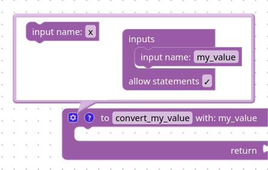
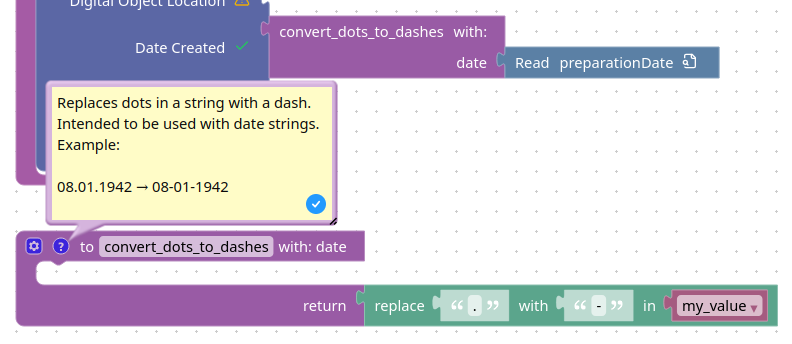

import { DemoWorkspace } from "../../components/demo/DemoWorkspace"

# Transformations using functions

Whenever it is necessary to transform data from a data source before supplying it to the FAIR DO Record, functions can be used. In the following sections, two examples for handling transformations with functions are shown.

## Applying complex transformations with placeholder functions

Some transformations can be complex to represent using visual programming or declaration.
In such cases, it may be the easiest way to add an empty function,
which takes your attribute as an input.
You will then need to implement this function later in the generated code base.

1. Add a function:
On the left sidebar,
click on the category “Functions”
and drag a function with a return-value-slot on your canvas.
Give it a proper name.
It should look like this:

<DemoWorkspace className="h-[8em]" blocks={[{
    type: "procedures_defreturn",
    id: "100",
    x: 10,
    y: 10,
    fields: {"NAME": "convert_my_value"}
}]} />
2. Give the function an input parameter for the attribute you want to convert.
In the step before, you might have noticed the little gear button on the top left?
Click on it.
A small menu will appear where you can add input parameters.
The figure below shows how it could look like in the end.
Consider giving the input a better name, though.

3. (Optional) Add more parameters for the conversion, if needed.
To do so, add more inputs as in the step before.
4. (Optional but recommended) Add an example return value.
To do so, add a value block with a constant value to the function's return slot.
Use the categories in the left sidebar to find such blocks.
5. (Optional but recommended) Add documentation.
Next to the gear button, there is a button with a question mark.
Click on it to open a text field,
and use it to describe the purpose and examples for this function.
It will help for the implementation later,
not only (but also) if you plan to use AI for code generation.
The next section shows a figure with an example.
6. Apply the function to your attribute block(s).
In the left sidebar,
inside the “Functions” category,
there is now a block with your chosen name
(e.g., “convert_my_value”).
Drag this block to the canvas,
attach your attribute block,
and then attach the result to the profile attribute to assign it.
The figure in the next section shows an example.

## Applying transformations with block functions

The previous section describes how to create empty functions to transform a value.
Of course, it is possible to use blocks for the transformation
and therefore generate the code without any further code required.
Note that this can be visually verbose in some cases.
A simple example is shown in the figure below.

For this, you may need to access your functions inputs.
In the figure above, it is the block with the “my_value” label on it.
These are available as blocks in the “Variables” category.
Note it is required to add the inputs to the function first,
before they appear in this category.

A result can be very complex or a simple shortcut for recurring patterns,
like in the following example:

Note how it is a standalone block,
and then applied to the “preparationDate” block to put it into the profile.