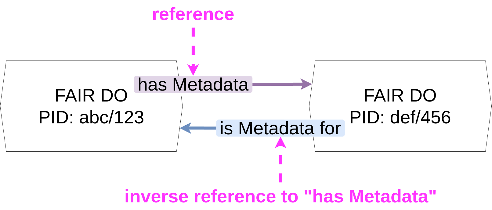
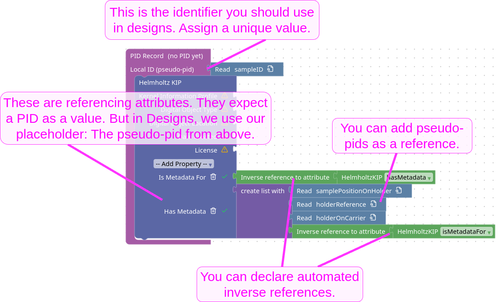

# Connecting FAIR DOs

PID Records of FAIR Digital Objects (FAIR DOs) contain
the most relevant metadata for identification and selection.
Similar to knowledge graphs, it is recommended to connect related FAIR DOs where it makes sense.

Profiles often provide attributes for such connections.
In many cases, these will be optional, as a profile creator usually can't make assertions about the connections of a specific FAIR DO.
This does not mean they are not important:
These connections are referencing
metadata,
creators,
related data,
or other context.
All of which can be relevant for decision-making and navigating the FAIR DO graph.

In a design, you can use placeholder PIDs (pseudo-pids) as a reference.
When registering the PIDs, they will be replaced with the real, final PIDs of each object.
The figure above describes how to define and assign the pseudo-pids visually.
It also shows that inverse references can be declared using two blocks.
These are available in the left sidebar, in the “Automatic backlinks” category.
