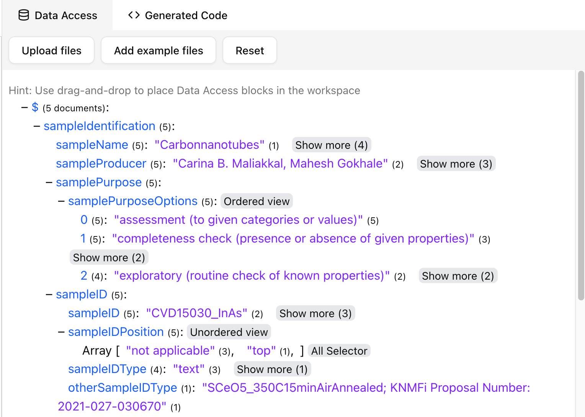
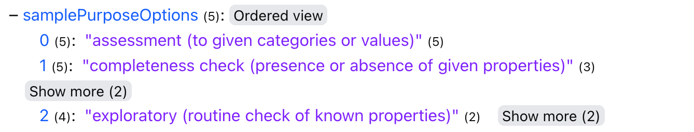
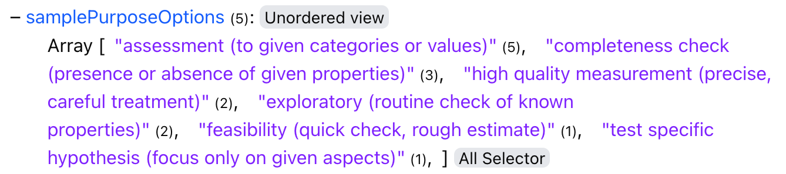

# Data Queries

To associate your FAIR DO with information from a data source, you can upload samples of your data to the FAIR DO Designer and create queries to retrieve data.
The FAIR DO Designer assumes your dataset to be a **collection of JSON documents**. Other structured data formats can easily be converted to JSON using external tools.

> [!note]
>
> You can write your own custom queries using the **Custom Query** block. It is also possible to adapt the generated code to include any querying mechanism of your choice.

## Uploading JSON files

You can start creating queries by uploading one or more JSON file(s). It is recommended to only upload a small number of files that are representative of your dataset.

To upload a file, click the **Upload files** button at the top of the Data Access tab. You can also use the **Add examples files** button to load sample data for testing and experimenting. The **Reset** button will clear all uploaded files, but your Workspace will remain untouched.

Once you have uploaded your JSON files, you will see a structured representation of them in the **Data Access** tab.

Shown here is a merged representation of the structure of the uploaded JSON files. The small number to the right of each field represents the number of times that field appears in the uploaded JSON files.
Fields that appear in all uploaded JSON files can be used without caution, while rarely present fields need to be queried with additional checks, to prevent data loss.

The dollar key `$` represents the root of the JSON documents and will always be shown.

## Creating queries

To create queries, you first have to upload one or more files in the Data Access tab.

Once you see a structured representation of your data, you can create queries by dragging and dropping keys (blue text) from the Data Access tab onto the Workspace. A query block will be created at the drop location.
You can right-click on a query block to view and edit the generated query.

By clicking the *file search* icon on the query block, the key corresponding to the query will be highlighted in the Data Access tab.

> [!note]
>
> Query blocks contain only the generated query. Resetting the Data Access tab or uploading new files will not affect existing query blocks.

### JSON Objects

Objects in uploaded JSON files are automatically merged by key. To query an entire object, you can drag-and-drop the key of the object onto the Workspace. To query a child of the object, you can do the same in the child's key.

> [!note]
>
> Not every key might be present in all files of your dataset. The small number to the right of the key indicates how many times the key was encountered. For keys that are not present in every JSON file, you should add additional check or redundancy blocks.

You can open and close objects by clicking on the plus `+` and minus `-` icons.

### JSON Arrays

Arrays can be viewed in either *ordered* mode or *unordered* mode.

#### Ordered

When viewing an array in *ordered* mode, the order of the elements is preserved. The indexes of the array elements are shown as keys. Each key (index) contains a list of elements encountered at this position in the array. The number to the right of each value indicates the number of times this value was encountered at this index.

#### Unordered
When viewing an array in *unordered* mode, the order of the elements is not preserved. The indexes of the array elements are not shown. Instead, all possible elements of the array are shown in a list. The number to the right of each value indicates the number of times this value was encountered at any index in the array.
