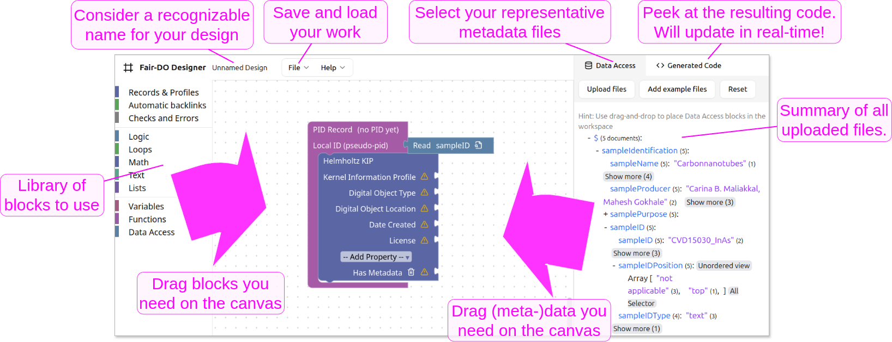

import { DemoWorkspace } from "../components/demo/DemoWorkspace"

# Getting Started

First, let's try to get an overview of the workflow and the most important functions:

The idea of the user interface is to pull-in information from your documents (right sidebar) and to combine it with declarative "blocks" from the left sidebar.

The FAIR DO Designer uses a visual way to express the design of records using blocks,
similar to programming-learning tools like “Scratch” or other visual programming tools.
Only well-connected blocks will be used in the design.
Other blocks will be visibly ignored until properly connected.
The visual difference is shown in the following figure:
<DemoWorkspace className="h-[5.5em]" blocks={[
  { type: "log_value", id: "0", x: 10, y: 10, "fields": {"DESC": "properly connected, used block"} },
  { type: "log_value", id: "1", x: 10, y: 50, enabled: false, "fields": {"DESC": "improperly connected, ignored block"} }
]} />

To delete a block, click on it to select it, then press the "delete" key on your keyboard.
Alternatively, you can drag it to the trash bin on the bottom right of the canvas.
It has the same effect.
You can restore deleted blocks by clicking on the trash bin.

## Step 1: Add your representative (meta-)data files

Those files should contain at least the information you'd like to add to your record.
It is okay if not every file will later have every piece of information.

> **Note**
>
> Just the ones your profile (more on that later) defines as mandatory, must be present.
> If it happens that a document will be incomplete in this sense, the request to register will (by default) not register any record to ensure incomplete connections.

The sidebar on the right summarizes all your JSON files.
You can add as many as you like.
The sidebar will show you how often an attribute is contained to give you an overview.
Clicking on an attribute or dragging it to the canvas will create a new block for it to connect.

If you do not have any files at hand, you can click “Add example files” in the sidebar to add some example documents.
Try to add a block for the “sampleID” attribute to the canvas.

> Note
>
> Looking at the “Read” block, you'll notice a small search icon.
> Clicking it will show you the origin of the block in the sidebar on the right.
>
> <DemoWorkspace className="h-22" blocks={[{ type: "input_jsonpath", id: "0", x: 10, y: 10, extraState: "$.sampleID" }]} />

## Step 2: Add a record and a profile

A design can create one or multiple records from a single file.
It depends on the amount of record blocks being added.
They look like this:

<DemoWorkspace blocks={[{ type: "pidrecord", id: "profile", x: 10, y: 100 }]} />

The record can then be filled with a profile or additional attributes.
A profile may or may not allow adding further profiles and attributes.

Profile and record blocks can be found in the according category in the left sidebar,
similar to all other blocks (except for the ones from your documents):

## Step 3: Connect all required fields

### Example: Add a license using a text block

TODO

## Step 4 (optional): Add optional attributes

A profile block has a drop-down menu at the bottom.
It allows you to add optional attributes.
Except from that they can be deleted, they work the same as required fields (see Step 3).

## Step 5: Save your design

Your work will be saved in the local storage of your browser.
While this can be convenient, it is not a permanent storage.
You can save your work to a file using the menu at the top.

> **Note**
>
> Before you save, consider giving your design a proper name.
> You can do this using the title left to the menu bar (see the overview image at the top of this document).

## Step 6: Export the design as python code

At the right sidebar, there is a tab called “Generated Code”.
From there, you can view the code which depends on your design.
To retrieve a full python project, click the download button in this tab.

