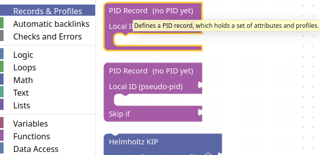
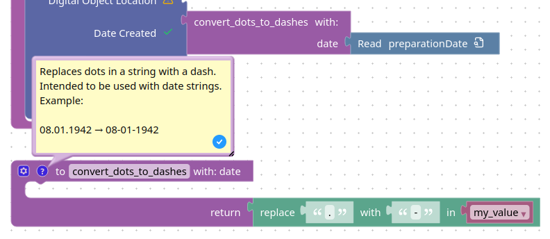

import { DemoWorkspace } from "../components/demo/DemoWorkspace"

# Getting Started

First, let's try to get an overview of the workflow and the most important functions:

The idea of the user interface is to pull-in information from your documents (right sidebar) and to combine it with declarative "blocks" from the left sidebar.

The FAIR DO Designer uses a visual way to express the design of records using blocks,
similar to programming-learning tools like “Scratch” or other visual programming tools.
Only well-connected blocks will be used in the design.
Other blocks will be visibly ignored until properly connected.
The visual difference is shown in the following figure:
<DemoWorkspace className="h-[5.5em]" blocks={[
  { type: "log_value", id: "0", x: 10, y: 10, "fields": {"DESC": "properly connected, used block"} },
  { type: "log_value", id: "1", x: 10, y: 50, enabled: false, "fields": {"DESC": "improperly connected, ignored block"} }
]} />

To delete a block, click on it to select it, then press the <kbd>delete</kbd> key on your keyboard.
Alternatively, you can drag it to the trash bin on the bottom right of the canvas.
It has the same effect.
You can restore deleted blocks by clicking on the trash bin.

## Step 1: Add your representative (meta-)data files

Those files should contain at least the information you'd like to add to your record.
It is okay if not every file will later have every piece of information.

> **Note**:
> Only the attributes your profile (more on that later) defines as mandatory,
> must be present.
> If it happens that a document will be incomplete in this sense,
> the request to register will (by default) not register any record to ensure incomplete connections.

The sidebar on the right summarizes all your JSON files.
You can add as many as you like.
The sidebar will show you how often an attribute is contained to give you an overview.
Clicking on an attribute or dragging it to the canvas will create a new block for it to connect.

If you do not have any files at hand, you can click “Add example files” in the sidebar to add some example documents.
Try to add a block for the “sampleID” attribute to the canvas.

> **Note**:
> Looking at the “Read” block, you'll notice a small search icon.
> Clicking it will show you the origin of the block in the sidebar on the right.
>
> <DemoWorkspace className="h-[4em]" blocks={[{ type: "input_jsonpath", id: "0", x: 10, y: 10, extraState: "$.sampleID" }]} />

## Step 2: Add a record and a profile

A design can create one or multiple records from a single file.
It depends on the amount of record blocks being added.
They look like this:

<DemoWorkspace className="h-[8em]" blocks={[{ type: "pidrecord", id: "profile", x: 10, y: 10 }]} />

The record can then be filled with a profile or additional attributes.
A profile may or may not allow adding further profiles and attributes.

Profile and record blocks can be found in the according category in the left sidebar,
similar to all other blocks (except for the ones from your documents):

## Step 3: Connect all required fields

The usual procedure to add required fields is to extract them from your documents:

1. Drag an attribute from the right sidebar into the canvas.
    Alternatively, you can simply click on it.
    In both cases, a new "Read" block will appear on the canvas.
    Such a block represents this attribute in any document.

    > **Note**:
    > Technically, the block represents a JSON-Path to the attribute in an arbitrary document.
    > The path can be viewed and modified by doing a right-click on the block.
2. Connect the attribute directly to an attribute.
    If the value is not in the correct format
    or needs other pre-processing,
    you can use the block from the left sidebar to create a processing chain.
    In the following sub-sections,
    we provide some recipes for common use cases.

### Example: Applying complex transformations with placeholder functions

Some transformations can be complex to represent using visual programming or declaration.
In such cases, it may be the easiest way to add an empty function,
which takes your attribute as an input.
You will then need to implement this function later in the generated code base.

1. Add a function:
    On the left sidebar,
    click on the category "Functions"
    and drag a function with a return-value-slot on your canvas.
    Give it a proper name.
    It should look like this:

    <DemoWorkspace className="h-[8em]" blocks={[{
        type: "procedures_defreturn",
        id: "100",
        x: 10,
        y: 10,
        fields: {"NAME": "convert_my_value"}
    }]} />
2. Give the function an input parameter for the attribute you want to convert.
    In the step before, ou might have noticed the little gear button on the top left?
    Clicking on it, it will open a small menu to add input parameters.
    This is how it should look like in the end.

    

    Consider giving it a better name, though.
3. (Optional) Add more parameters for the conversion, if needed.
    To do so, simply add more inputs as in the step before.
4. (Optional but recommended) Add an example return value.
    To do so, simply add a value block with a constant value to the function's return slot.
    To find such blocks, use the categories in the left sidebar.
5. (Optional but recommended) Add example input-output-pairs to the documentation.
    Next to the gear button, there is a button with a question mark.
    Klicking it will open a text field,
    which you can use to describe the purpose and examples for this function.
    Use this to document the purpose and intended functionality.
    It will help for the implementation later,
    also if you plan to use AI for code generation.
6. Apply the function to your attribute block(s).
    In the left sidebar,
    inside the "Functions" category,
    there is now a block with your chosen name
    (e.g. "convert_my_value").
    You can add this block,
    attach your attribute block,
    and then attach the result to the profile attribute to assign it.

### Example: Applying transformations with block functions

The previous section describes how to create empty functions to transform a value.
Of course, it is possible to use blocks for the transformation
and therefore generate the code without any further code required.
Note that this can be visually verbose in some cases.

For this, you may need to access your functions inputs.
These are available as blocks in the "Variables" category.
Note it is required to add the inputs to the function first.

A result can be very complex or a simple shortcut for recurring patterns,
like in the following example:

Note how it is a standalone block,
and then applied to the "preparationDate" block to put it into the profile.

### Example: Add additional, basic information using a text block

Assume your data is missing some basic information,
like the license of your data.
You can add such information as a string and provide it to your record:

1. In the left sidebar, open the "Text" category and click or drag a text block onto the canvas.
    Attach the field to the license attribute in the profile and insert a value into its text field, like this:
    <DemoWorkspace className="h-[4em]" blocks={[{ type: "text", id: "0", x: 10, y: 10, fields: {"TEXT": "Apache-2.0"} }]} />

## Step 4 (optional): Add optional attributes

Each profile block has a drop-down menu at the bottom.
It allows you to add further optional attributes.
While you do not need to add such attributes,
it is recommended to at least state all connections to other objects,
as well as information which will be useful for selecting data for certain tasks.
Except from that they can be deleted,
they work the same as required fields (see Step 3).

## Step 5: Save your design

Your work will be saved in the local storage of your browser.
While this can be convenient, it is not a permanent storage.
You can save your work to a file using the menu at the top.

> **Note**:
> Before you save, consider giving your design a proper name.
> You can do this using the title left to the menu bar (see the overview image at the top of this document).

## Step 6: Export the design as python code

At the right sidebar, there is a tab called “Generated Code”.
From there, you can view the code which depends on your design.
To retrieve a full python project, click the download button in this tab.

