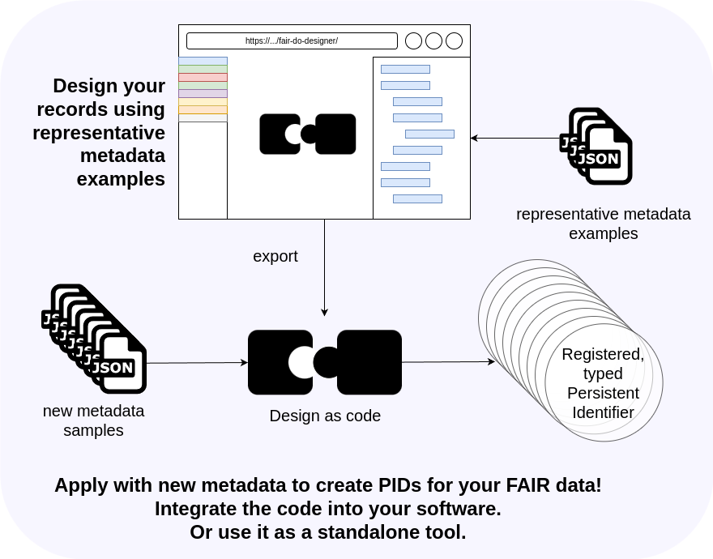

# Introduction

*PID records*, or short records,
are the place where *FAIR Digital Objects* (FAIR DOs) store information.
This information is stored in the PID system of the chosen identifier,
while the location of your data and metadata is up to you.

Record information serves machines to make early decisions.
Before a machine needs to know about the specific APIs of repositories or other details,
it can use it as a common ground to make early decisions.
For example
if it has interest in this data,
if it can access it automatically,
or which operations it can use on this FAIR DO.

The *FAIR DO Designer* will help with the task of
extracting,
mapping,
and maintaining
this information.

The FAIR DO Designer helps you to create Designs for properly typed PID records.
Designs make FAIR DO creation repeatable, consistent, and automatable.
Given representative metadata (in any JSON format), you can create Designs “by example”.

Designs define which information to extract and how to assemble the records.
A design can be exported as code, which can be applied repeatedly to given metadata.
You can execute the code from the command line or modify and integrate it into your application.